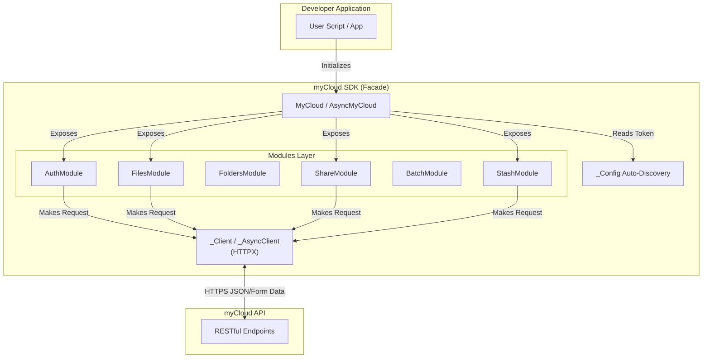

<div align="center">
  
  <h1>myCloud Python SDK</h1>
  <p><em>The official Python SDK for myCloud. A robust, fully-featured, and type-safe interface for developers.</em></p>
  <p>
    <a href="https://pypi.org/project/mycloud-sdk/"><strong>PyPI Package</strong></a> |
    <a href="https://cloud.mysphere.co.in"><strong>myCloud Web</strong></a>
  </p>

  
  
  
</div>

---

## Executive Summary

The **myCloud Python SDK** is the core programmatic interface to the myCloud ecosystem. Designed for developers building automation scripts, Discord bots, web servers, or custom integrations, the SDK provides both synchronous (blocking) and asynchronous (non-blocking) clients out of the box.

---

## Project Highlights

- **Dual API Design:** Seamlessly switch between `MyCloud` for standard scripts and `AsyncMyCloud` for high-concurrency `asyncio` applications.
- **Zero-Configuration:** Automatically detects and integrates with existing CLI credentials (`~/.mycloud/credentials.json`), requiring zero setup for authenticated users.
- **Type-Safe:** Written with complete Python type hints (PEP 484), providing excellent IDE integration, autocomplete, and static analysis.
- **Graceful Error Handling:** Custom exception mapping translates opaque HTTP status codes into strongly-typed Python exceptions (e.g., `AuthError`, `NotFoundError`, `ValidationError`).
- **Comprehensive API Coverage:** Supports 100% of the myCloud API, including file lifecycle, stash workflows, batch operations, and storage node administration.

---

## System Architecture

The SDK is architected using the **Facade Design Pattern**. A central `MyCloud` client delegates specific functionalities to modular, domain-specific classes.



### Architecture Highlights:
- **Module Segregation:** Code is logically split into distinct modules (`files.py`, `folders.py`, `stash.py`). The main `MyCloud` class registers these modules during `__init__`, exposing them intuitively as properties (e.g., `cloud.files.upload()`).
- **Shared Network Core:** Both the synchronous and asynchronous implementations rely on a central `HTTPX` client wrapper (`_Client` and `_AsyncClient`) that automatically handles JWT injection, multipart form data encoding, and JSON parsing.
- **Async Context Management:** `AsyncMyCloud` supports standard `async with` context managers for proper connection pooling and teardown.

---

## Developer Experience (DX)

The SDK was built with a relentless focus on Developer Experience.

### Synchronous Usage
Clean, readable, and pythonic.
```python
from mycloud import MyCloud
from mycloud.exceptions import NotFoundError

# Auto-discovers credentials
cloud = MyCloud()

try:
    file = cloud.files.upload("dataset.csv")
    print(f"Uploaded successfully! ID: {file.id}")
except NotFoundError:
    print("Folder does not exist.")
```

### Asynchronous Concurrency
Designed for massive parallel processing.
```python
import asyncio
from mycloud import AsyncMyCloud

async def bulk_upload():
    async with AsyncMyCloud() as cloud:
        # Upload 100 files concurrently
        tasks = [cloud.files.upload(f"data_{i}.txt") for i in range(100)]
        results = await asyncio.gather(*tasks)
        print(f"Successfully uploaded {len(results)} files.")

asyncio.run(bulk_upload())
```

---

## Technology Stack

| Category | Technology |
| --- | --- |
| **Language** | Python 3.10+ |
| **HTTP Client** | HTTPX |
| **Concurrency** | asyncio |
| **Testing** | pytest, pytest-asyncio |
| **Packaging** | setuptools, build, twine |

---

## Engineering Challenges

1. **Sync/Async Code Duplication:** Maintaining feature parity between synchronous and asynchronous modules is notoriously difficult in Python. The SDK utilizes an intelligent structural separation where core DTOs (Data Transfer Objects) and exception parsing logic are shared between the `modules/` and `async_modules/` directories, minimizing redundant code.
2. **Stream Handling:** Correctly routing raw byte streams from `HTTPX` iterators to local disk without loading entire gigabyte files into RAM, while simultaneously supporting real-time progress callbacks for CLI implementations.
3. **Error Normalization:** The backend API can sometimes return HTML error pages or inconsistent JSON structures during unexpected failures (e.g., 502 Bad Gateway from Nginx). The SDK's underlying network core intercepts and normalizes these into standard Python exceptions.

---

## Repository Scope

> **IMPORTANT NOTICE:** 
> This repository is intended exclusively as a **project showcase and portfolio piece**. 
> 
> To protect proprietary business logic and the core source code, **the actual application logic is not published here**. This README serves to demonstrate the architectural design and professional standards applied during the development of the myCloud SDK.

---

## Contact & Links

- **Email:** kanhaiffco2007@gmail.com
- **LinkedIn:** [linkedin.com/in/rudransh-shekhar](https://linkedin.com/in/rudransh-shekhar)
- **Portfolio:** [rudransh-shekhar.netlify.app](https://rudransh-shekhar.netlify.app)
- **PyPI Package:** [mycloud-sdk](https://pypi.org/project/mycloud-sdk/)
- **Live Platform:** [cloud.mysphere.co.in](https://cloud.mysphere.co.in)
- **Ecosystem Hub:** [mysphere.co.in](https://mysphere.co.in)
- **GitHub:** [github.com/rudy-07](https://github.com/rudy-07)

<div align="center">
  <p>Built with passion and engineering rigor. © 2026</p>
</div>
